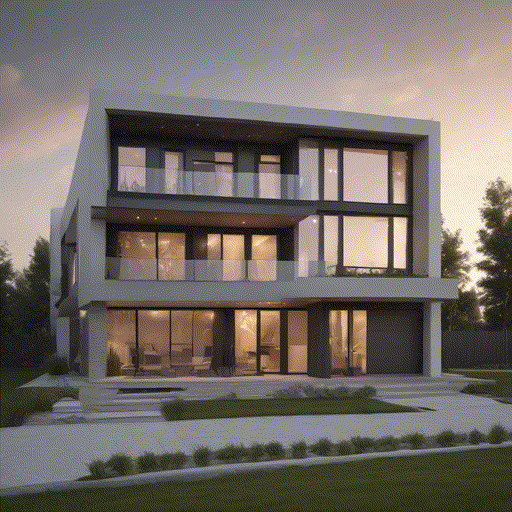
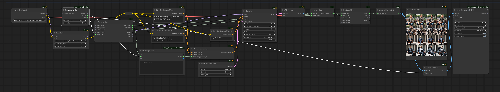
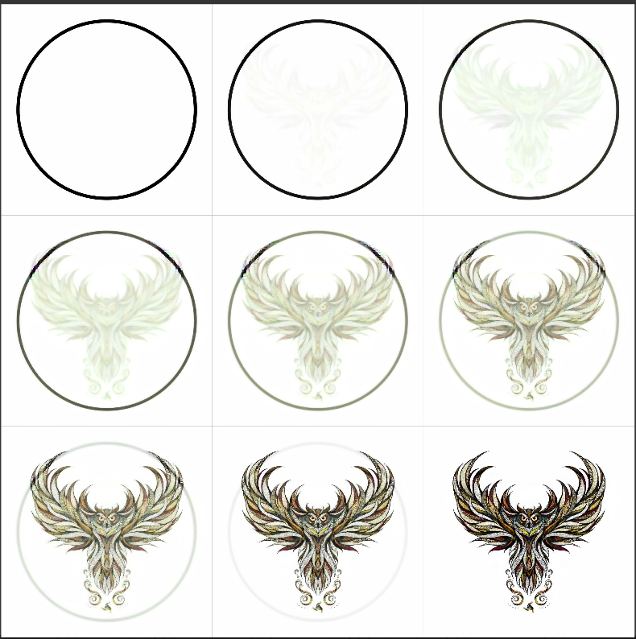
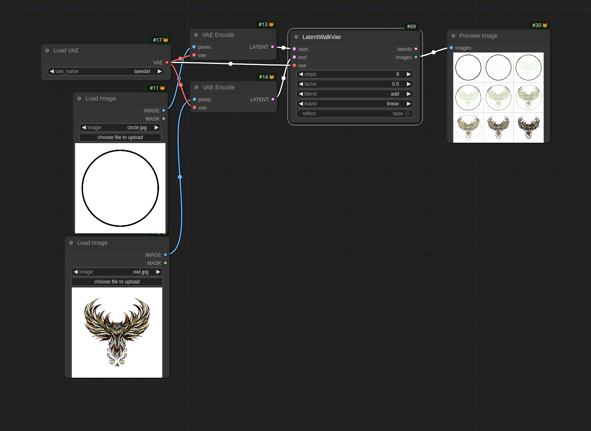
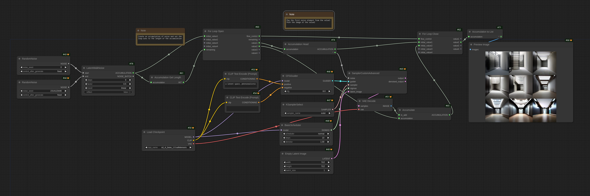
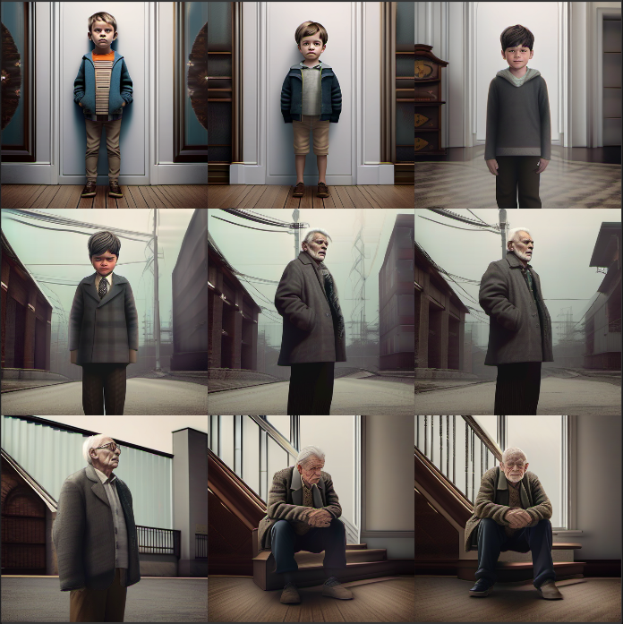
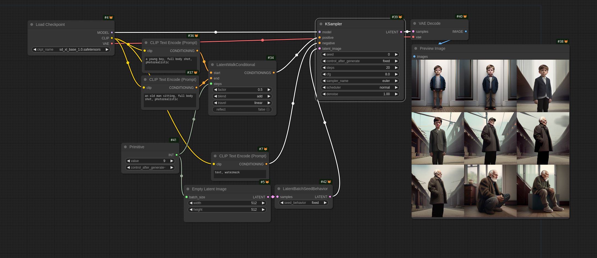
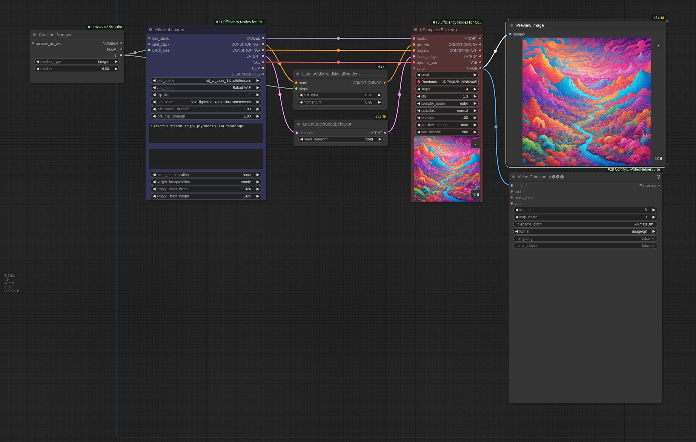

# ComfyUI LatentWalk

Based on [ComfyUI_TravelSuite by NicholasMcCarthy](https://github.com/NicholasMcCarthy/ComfyUI_TravelSuite)

This suite of nodes allows for different types of latent walks, offering flexibility in interpolation and blending across various latent spaces. It supports walking between latent spaces, conditional latents, and even noise spaces. The supported modes of travel and blend give a wide variety of creative options.

Here is an example made with flux.1-schnell-gguf-4:




Here is a workflow on how you can do the same without this package - but with 20+ nodes instead of 10 and no batch-computing - therefore significantly slower.




## Nodes

1. [LatentWalkVae](#latentwalkvae)
2. [LatentWalkNoise](#latentwalknoiseaccumulation)
3. [LatentWalkConditional](#latentwalkconditional)
4. [LatentWalkConditionalRandom](#latentwalkconditionalrandom)

Each of these nodes facilitates a unique type of latent walk, detailed below.

### Travel Modes

1. **linear**: Linear interpolation from start to end.
2. **circle**: Interpolates along a circular path in latent space.
3. **quadratic**: Steps along a quadratic (x²) path.
4. **cubic**: Steps along a cubic (x³) path.
5. **quartic**: Steps along a quartic (x⁴) path.
6. **geometric**: Steps along a geometric progression.
7. **hinge**: Splits the steps at a given cut point (hinge) and interpolates above and below the cut point separately.
8. **norm**: Steps according to a normal distribution centered at 0.5. The `factor` parameter adjusts the Gaussian scale.

### Blend Modes

1. **lerp**: Linear interpolation between latents.
2. **slerp**: Spherical interpolation between latents.
3. **add**: Adds two latent vectors.
4. **multiply**: Multiplies two latent vectors element-wise.
5. **divide**: Divides one latent vector by another element-wise.
6. **subtract**: Subtracts one latent vector from another.
7. **overlay**, **hard_light**, **soft_light**, **screen**: Standard image blend modes applied to latent vectors.
8. **linear_dodge**: Lightens latent vectors by increasing brightness.
9. **difference**: Subtracts colors and inverts the result when needed.
10. **exclusion**: Similar to difference but with less contrast.
11. **random**: Applies random noise between the two latent vectors.

---

## LatentWalkVae

Travel in LATENT / VAE encoded space.

### Node Inputs

- **start**: Starting latent vector (`LATENT`).
- **end**: Ending latent vector (`LATENT`).
- **steps**: The number of steps for interpolation (min: 3, max: 10000, default: 5). This determines the number of intermediate latents generated.
- **factor**: A floating-point value influencing the travel behavior, depending on the travel mode (default: 0.5) - only relevant for the travel-modes hinge and norm.
- **blend**: Specifies the blending mode used during interpolation. See [Blend Modes](#blend-modes) for available options.
- **travel**: Determines the mode of interpolation (traveling). See [Travel Modes](#travel-modes) for available options.
- **reflect**: Boolean indicating whether the travel values should be reflected around the midpoint (default: `False`).
- (Optional) **vae_model**: A trained VAE model for decoding latent vectors into images.

### Node Outputs

- **latents**: A series of latent vectors representing the transition from the start latent to the end latent over the specified number of steps.
- **images**: A series of images decoded from the latent vectors using the provided VAE model.

### Example + Workflow



---

## LatentWalkNoise

Travel in the NOISE space of the advanced sampler.

Currently, samplers don't support batches / lists of noise vectors, so this node requires [execution inversion demo for loops](https://github.com/BadCafeCode/execution-inversion-demo)

### Node Inputs

Same as [LatentWalk](#latentwalkvae): `start`, `end`, `steps`, `factor`, `travel`, `reflect` but without `blend`.

But the only blending mode is `add` due to technical limitations - as well as the requirement that noise-vectors must have a specific linalg-norm to work - which is why some post-processing is required.

### Node Outputs

- **list**: A batch of noise vectors, in case samplers support it in the future.
- **accumulation**: Accumulated noise vectors that can be used in for-loop operations.

### Example + Workflow



---

## LatentWalkConditional Node

Travel the CONDITIONING / CLIP encoded space.

**Requires the correct batch_size in the latent_space node and the noise

### Node Inputs

Same as [LatentWalk](#latentwalkvae): `start`, `end`, `steps`, `factor`, `travel`, `blend`, `reflect`.

### Node Outputs

- **conditionings**: A batch of conditioning vectors.

### Example + Workflow



---

## LatentWalkConditionalRandom Node

Travel the CONDITIONING / CLIP encoded space with random noise. Normalize the CONDITIONING to have the same length as `start`.

``` python
class LatentWalkConditionalRandom:
    @classmethod
    def INPUT_TYPES(cls):
        return {"required": {
            "start": ("CONDITIONING",),
            "dist_mult": ("FLOAT", {"default": 0.5, "min": 0.001, "max": 1000.0, "step": 0.01}),
            "momentum": ("FLOAT", {"default": 0.0, "min": 0.0, "max": 1.0, "step": 0.01}),
            "steps": ("INT", {"default": 9, "max": 10000, "step": 1}),
        }}

    RETURN_TYPES = ("CONDITIONING",)
    RETURN_NAMES = ("CONDITIONINGS",)
    FUNCTION = "latent_walk_conditional_random"

    def latent_walk_conditional_random(self, start, dist_mult, momentum, steps):
        sc, sp = unpack_conditioning(start)
        rc = torch.cat(list(random_walk(sc, dist_mult, momentum, steps)), 0)
        rp = torch.cat(list(random_walk(sp, dist_mult, momentum, steps)), 0)
        return ([[rc, {"pooled_output": rp}]],)
```

### Node Inputs
* **start**: Starting latent vector (`CONDITIONING`).
* **dist_mult**: Multiplier to the length of the original latent space length for a step (default: 0.5).
* **momentum**: How far to go into the same direction as the last step. 0 = off, perfectly random, 1.0 = go in a straight line. (default: 0.0).
* **steps**: The number of steps for interpolation (min: 3, max: 10000, default: 5). This determines the number of intermediate latents generated.

### Node Outputs
* **conditionings**: A batch of conditioning vectors.

### Example + Workflow



## Installation

To install the LatentWalk nodes, simply place the scripts in your ComfyUI `custom_nodes` folder and restart the application.

